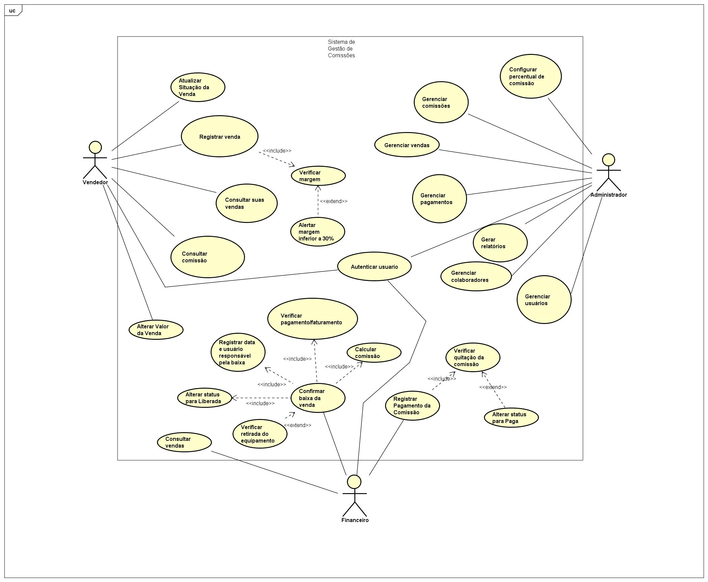
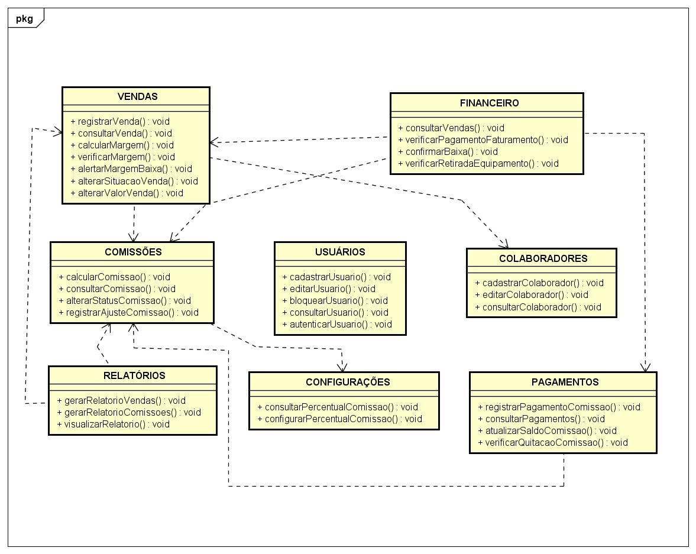

# Diagramas do Sistema

Esta seção reúne os principais diagramas desenvolvidos para o **Sistema de Gestão de Comissões — Hitek Informática**.

Os diagramas representam diferentes perspectivas do sistema:

- interação entre usuários e funcionalidades;
- fluxo principal do processo de comissões;
- organização dos módulos e funções do sistema.

---

## Diagrama de Casos de Uso

O Diagrama de Casos de Uso apresenta os atores do sistema e as funcionalidades com as quais cada perfil interage.

Os atores definidos são:

- Vendedor;
- Financeiro;
- Administrador.

Entre as principais funcionalidades representadas estão:

- autenticação de usuário;
- registro e consulta de vendas;
- consulta de comissões;
- confirmação de baixa;
- registro de pagamento da comissão;
- gerenciamento de usuários;
- gerenciamento de colaboradores;
- gerenciamento de vendas;
- gerenciamento de comissões;
- gerenciamento de pagamentos;
- geração de relatórios;
- configuração do percentual de comissão.

O diagrama também utiliza os relacionamentos `<<include>>` e `<<extend>>` quando aplicáveis.

### Visualização



[Ver imagem em tamanho original](casos-de-uso.png)

---

## Diagrama Estendido

O Diagrama Estendido apresenta a organização funcional do sistema por meio de módulos e suas respectivas funções.

Os módulos definidos são:

- Vendas;
- Financeiro;
- Comissões;
- Usuários;
- Colaboradores;
- Pagamentos;
- Relatórios;
- Configurações.

O objetivo desse diagrama é representar como as principais funcionalidades do sistema estão organizadas e relacionadas.

### Visualização



[Ver imagem em tamanho original](estendido.png)

---

## Arquivo editável

O arquivo editável dos diagramas desenvolvidos no Astah também poderá ser armazenado nesta pasta.

Arquivo previsto:

```text
sistema-comissoes.asta
```

Esse arquivo permite abrir e editar os diagramas diretamente no Astah UML.

---

## Arquivos da seção

```text
03-diagramas/
├── README.md
├── casos-de-uso.png
├── atividade.png
├── estendido.png
└── sistema-comissoes.asta
```

---

## Relação entre os diagramas

Cada diagrama apresenta uma visão diferente do sistema:

| Diagrama | Objetivo |
|---|---|
| Casos de Uso | Mostrar quem utiliza o sistema e quais funcionalidades pode executar |
| Atividade | Mostrar como o processo principal acontece e em qual ordem |
| Estendido | Mostrar como o sistema está organizado em módulos e funções |

---

## Documentação relacionada

- [Casos de Uso](../02-engenharia-de-software/casos-de-uso.md)
- [Arquitetura do Sistema](../02-engenharia-de-software/arquitetura.md)
- [Regras de Negócio](../01-visao-geral/regras-de-negocio.md)

---

[← Voltar ao README principal](../../README.md)
